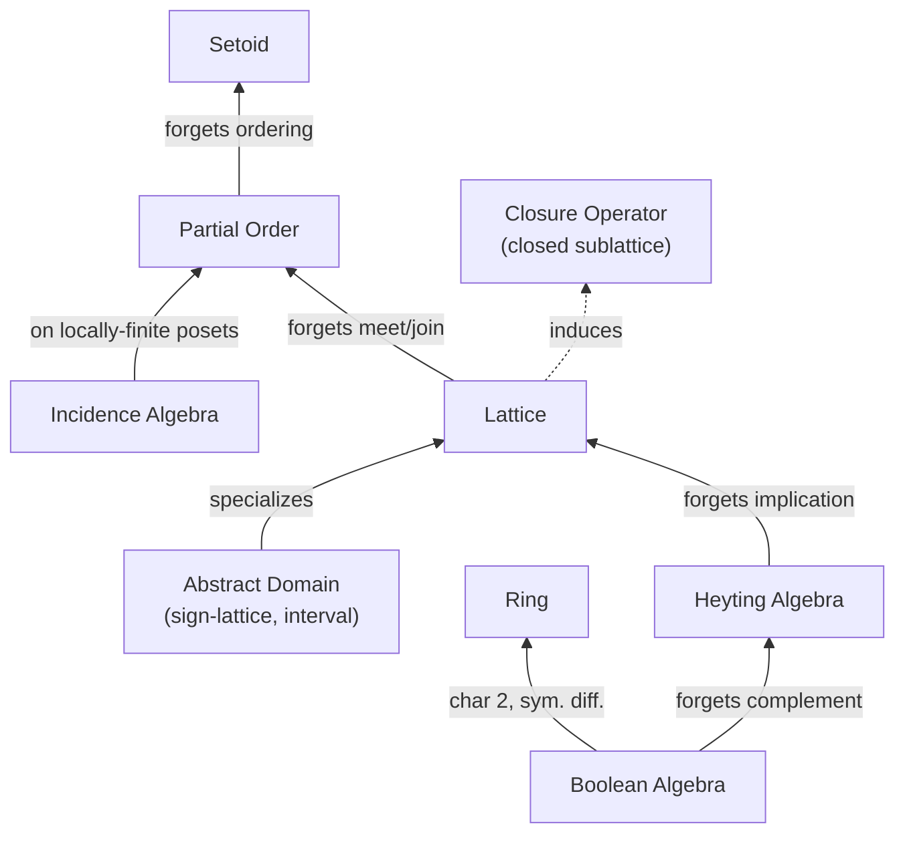
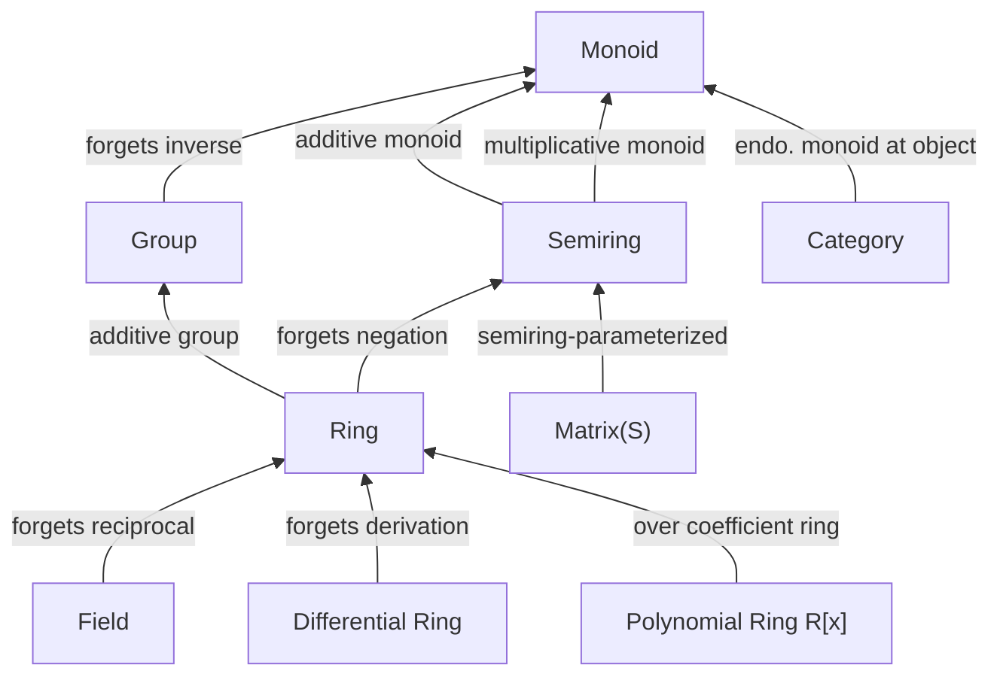
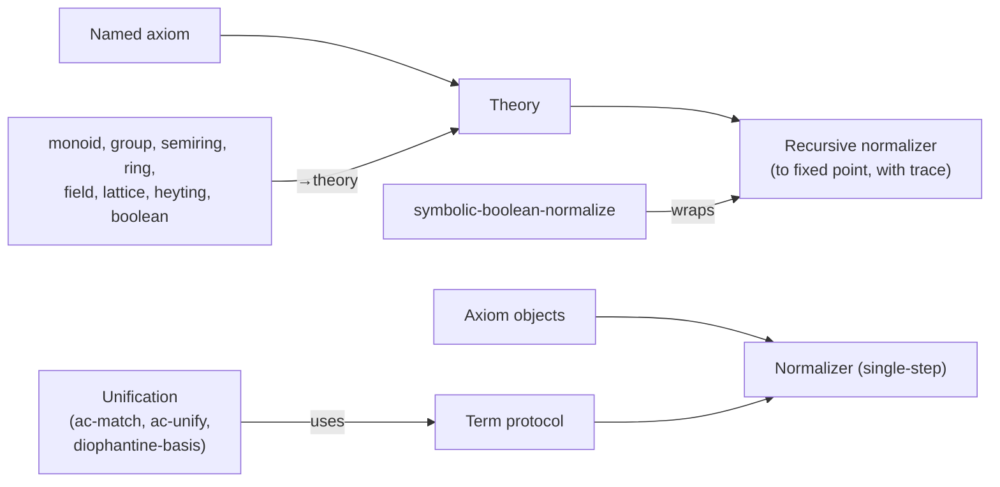
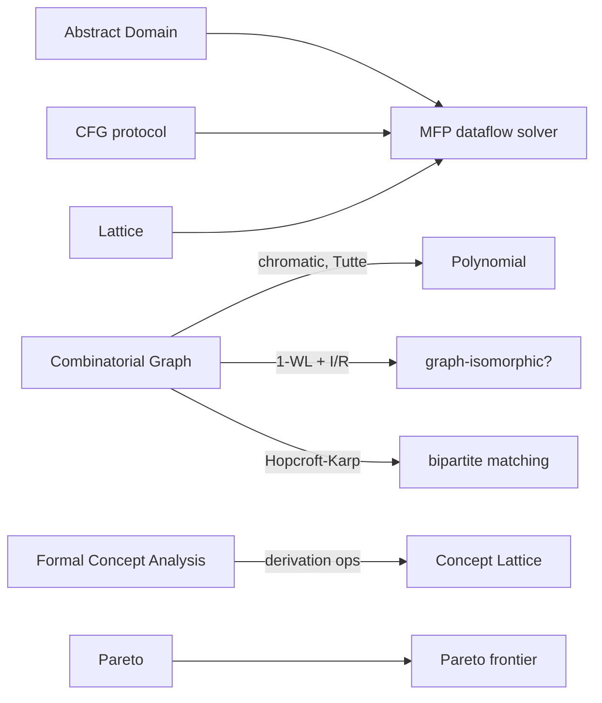

# (wile algebra) -- Algebraic Structures and Symbolic Rewriting

## Overview

The `(wile algebra)` library provides algebraic structures as composable
R7RS records, equational rewriting driven by axiom objects, and symbolic
normalization with transformation tracing. It covers setoids, partial
orders, lattices, closure operators, Heyting and Boolean algebras, monoids,
categories, semirings, groups, rings, differential rings, fields, and
Galois connections. Import `(wile algebra)` for all exports, or individual
sub-libraries like `(wile algebra monoid)` or `(wile algebra rewrite)` for
a narrower scope.

Here is what using it looks like:

```scheme
(import (wile algebra))

(define str-monoid (make-monoid string-append ""))
(monoid-fold str-monoid '("hello" " " "world"))  ;=> "hello world"
(validate-monoid str-monoid '("" "a" "bc"))       ;=> #t
```

Three lines: construct a structure from closures, compute with it, verify
its laws hold. The rest of the library follows the same pattern at every
level of abstraction.

## Design Philosophy

Structures are R7RS records whose fields are operation closures. A monoid
stores a binary operation and an identity element; a ring stores plus,
times, zero, one, and negate. There is no class hierarchy and no
inheritance. Composition happens explicitly: `ring->semiring` extracts the
semiring inside a ring by building a new semiring record from the ring's
plus, times, zero, and one. These forgetful projections mirror the
category-theoretic notion of a forgetful functor -- they discard operations
the target structure does not need.

Every structure serves three orthogonal roles. *Operationally*, its
closures compute: `(ring-plus Z 3 4)` returns 7. *Equationally*, the
structure's axioms drive symbolic rewriting: `ring->theory` projects a ring
into a theory whose axioms (additive identity, multiplicative absorbing
element, commutativity, etc.) normalize S-expression terms.
*Explanatorily*, named axioms carry human-readable names and general-form
strings, and the recursive normalizer records every rewrite step in a
trace, so the path from input to normal form is auditable.

This separation means you can compute with a ring, derive a rewriting
theory from the same ring, simplify symbolic expressions using that theory,
and inspect exactly which axioms fired and in what order -- all from one
record definition.

## Structure Hierarchy

The library organizes into three layers: a lattice-theoretic foundation,
an algebraic tower, and a rewriting/symbolic layer. Arrows indicate
forgetful projections (the target forgets some structure).

**Foundation**



**Algebra**



**Rewriting and symbolic**



**Analysis (compositions of foundation + algebra)**



Each arrow discards exactly one capability. `field->ring` forgets the
reciprocal. `ring->semiring` forgets negation. `boolean->heyting` forgets
complement. `heyting->lattice` forgets implication. `group->monoid` forgets
inverse. This means any algorithm written against a semiring works on
rings and fields too -- just project first.

Galois connections bridge two partial orders with an adjoint pair of
monotone maps (alpha, gamma). They do not participate in the forgetful
projection chain but connect concrete and abstract domains.

## Patterns

**Validation.** Every structure type has a `validate-X` procedure that
spot-checks algebraic laws against sample elements. Pass a structure and a
list of sample values; it returns `#t` if all laws hold or a list of
violation descriptions if any fail. This is not a proof -- it is a
property-based sanity check. Use it during development to catch mistakes in
custom structure definitions.

**Destructuring macros.** Each structure type has a `with-X` syntax macro
that binds its operations to local names. `(with-ring Z (plus times zero
one negate) ...)` lets you write `(times (plus a b) (plus a (negate b)))`
instead of `(ring-times Z (ring-plus Z a b) (ring-plus Z a (ring-negate Z
b)))`. The names are yours to choose.

**Forgetful projections.** Functions like `ring->semiring`, `group->monoid`,
and `boolean->heyting`, then `heyting->lattice`, extract simpler structures
from richer ones. They build new records from the relevant fields of the
source. Code that only needs a monoid can accept one projected from a
group, ring, or semiring -- no adapter needed.

**Predicate-based matching.** Axiom constructors like `make-identity-axiom`
and `make-absorbing-axiom` take a predicate, not a value. The identity
axiom for addition takes `(lambda (x) (eq? x 'zero))`, not the symbol
`zero` itself. This lets axioms match structural identity without requiring
`equal?` on arbitrary terms.

**`#f` for no-match.** A single-step normalizer built by `make-normalizer`
returns the rewritten term when a rule fires and `#f` when no rule applies.
This makes it easy to compose normalizers or loop until a fixed point: keep
applying until the result is `#f`.

**Preset structures.** Many libraries ship canonical examples as nullary
or small-arity constructors: `integer-ring`, `rational-field`, `cyclic-group
n`, `symmetric-group n`, `chain-lattice n`, `two-point-lattice`,
`boolean-lattice n`, `diamond-lattice n`, `pentagon-lattice`,
`free-distributive-lattice n`,
`sign-lattice`, `complete-graph n`, `cycle-graph n`, `petersen-graph`.
Reach for the preset when the classical case fits; build from scratch
when the domain is custom. Presets short-circuit the "build, then check
it's what you wanted" dance that plagues hand-written instances.

## Learning Path

The tutorial under [`examples/algebra/tutorial/`](../../examples/algebra/tutorial/)
is the primary entry point. Each chapter is a runnable `.scm` file: read
it, run it (`wile --file <chapter>`), and modify it. CI runs every chapter
via `make tutorial-test`, so drift between tutorial and library is caught
automatically. See the [tutorial README](../../examples/algebra/tutorial/README.md)
for the full chapter list with prerequisites.

**Deep chapters** (thematic, build on each other):

1. **[`01-getting-started.scm`](../../examples/algebra/tutorial/chapters/01-getting-started.scm)** --
   Monoids from scratch. `make-monoid`, `monoid-fold`, `monoid-power`,
   `validate-monoid`, `with-monoid`. Monoids on strings, lists, booleans.
2. **[`02-structures.scm`](../../examples/algebra/tutorial/chapters/02-structures.scm)** --
   The algebraic tower: lattice, semiring, group, ring, field, differential
   ring, Boolean algebra. Forgetful projections in depth.
3. **[`03-rewriting-basics.scm`](../../examples/algebra/tutorial/chapters/03-rewriting-basics.scm)** --
   Term protocols, all seven axiom types, composed normalizers.
4. **[`04-boolean-simplifier.scm`](../../examples/algebra/tutorial/chapters/04-boolean-simplifier.scm)** --
   `boolean->theory`, recursive normalizer with traces, Heyting vs Boolean.
5. **[`05-symbolic-differentiation.scm`](../../examples/algebra/tutorial/chapters/05-symbolic-differentiation.scm)** --
   Polynomials + `poly-derivative` + `polynomial-derivation`; hand-written
   symbolic differentiator cross-checked against `poly-derivative`.
6. **[`06-graph-algorithms.scm`](../../examples/algebra/tutorial/chapters/06-graph-algorithms.scm)** --
   BFS, isomorphism (C_6 vs 2·K_3 cospectral canary), τ(Petersen) = 2000,
   chromatic polynomials, Hopcroft-Karp on K_{3,3} and K_{2,4}.
7. **[`07-group-actions.scm`](../../examples/algebra/tutorial/chapters/07-group-actions.scm)** --
   Preset groups and actions, orbit / stabilizer, Burnside on necklaces.
8. **[`08-lattice-presets.scm`](../../examples/algebra/tutorial/chapters/08-lattice-presets.scm)** --
   Canonical lattices, `distributive?` / `modular?`, Birkhoff roundtrip,
   Dedekind numbers through D(4), Möbius on the divisor poset of 12.
9. **[`09-dataflow-analysis.scm`](../../examples/algebra/tutorial/chapters/09-dataflow-analysis.scm)** --
   MFP solver, CFG protocol, sign domain; straight-line and branching CFGs.
10. **[`10-unification.scm`](../../examples/algebra/tutorial/chapters/10-unification.scm)** --
    Pattern variables, substitutions, AC unification, `diophantine-basis`.
11. **[`11-equivalence-discovery.scm`](../../examples/algebra/tutorial/chapters/11-equivalence-discovery.scm)** --
    `discover-equivalences` across sub-theories, theory combinators,
    `format-trace`, fuel exhaustion.

**Quick-tour files** (single-library demos, not ordered):

- [`setoid.scm`](../../examples/algebra/tutorial/quick-tour/setoid.scm)
- [`partial-order.scm`](../../examples/algebra/tutorial/quick-tour/partial-order.scm)
- [`closure.scm`](../../examples/algebra/tutorial/quick-tour/closure.scm)
- [`category.scm`](../../examples/algebra/tutorial/quick-tour/category.scm)
- [`galois.scm`](../../examples/algebra/tutorial/quick-tour/galois.scm)
- [`fca.scm`](../../examples/algebra/tutorial/quick-tour/fca.scm)
- [`graph.scm`](../../examples/algebra/tutorial/quick-tour/graph.scm)
- [`interval.scm`](../../examples/algebra/tutorial/quick-tour/interval.scm)
- [`matrix.scm`](../../examples/algebra/tutorial/quick-tour/matrix.scm)
- [`pareto.scm`](../../examples/algebra/tutorial/quick-tour/pareto.scm)
- [`matching.scm`](../../examples/algebra/tutorial/quick-tour/matching.scm)
- [`sat.scm`](../../examples/algebra/tutorial/quick-tour/sat.scm)

## See Also

- [`tutorial.md`](tutorial.md) -- tutorial index with chapter prerequisites.
- [`reference.md`](reference.md) -- Complete API reference for all structures,
  projections, rewriting, and symbolic operations.
- `BIBLIOGRAPHY.md` -- Academic references (abstract algebra, lattice
  theory, term rewriting).
- `test/wile/algebra-*.scm` -- Test files covering each sub-library.
  These serve as additional usage examples beyond the guided tutorial.
