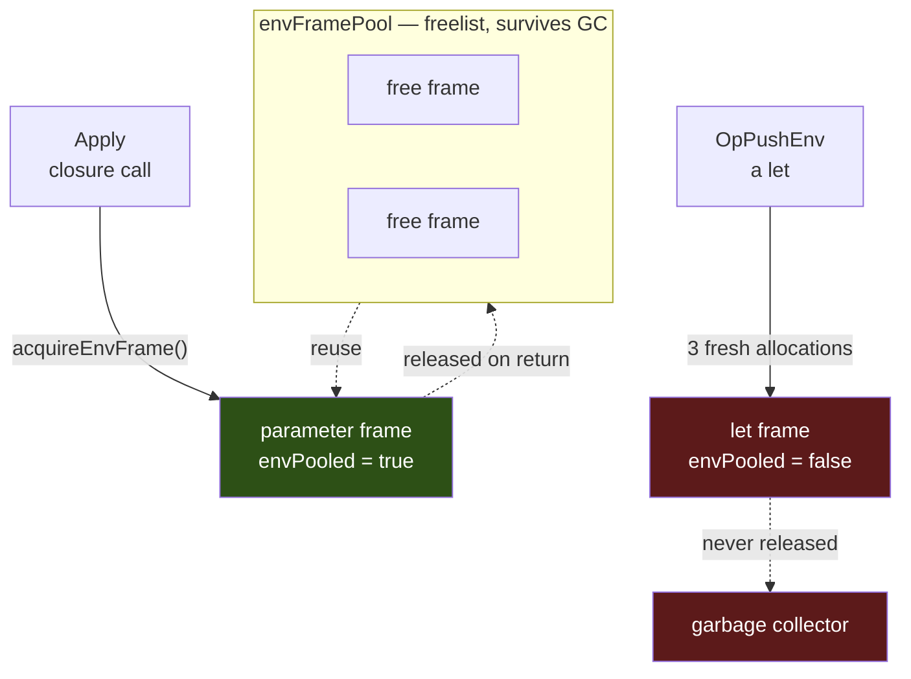
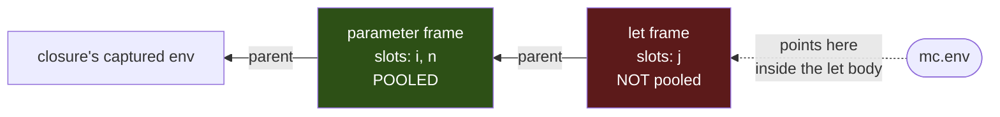
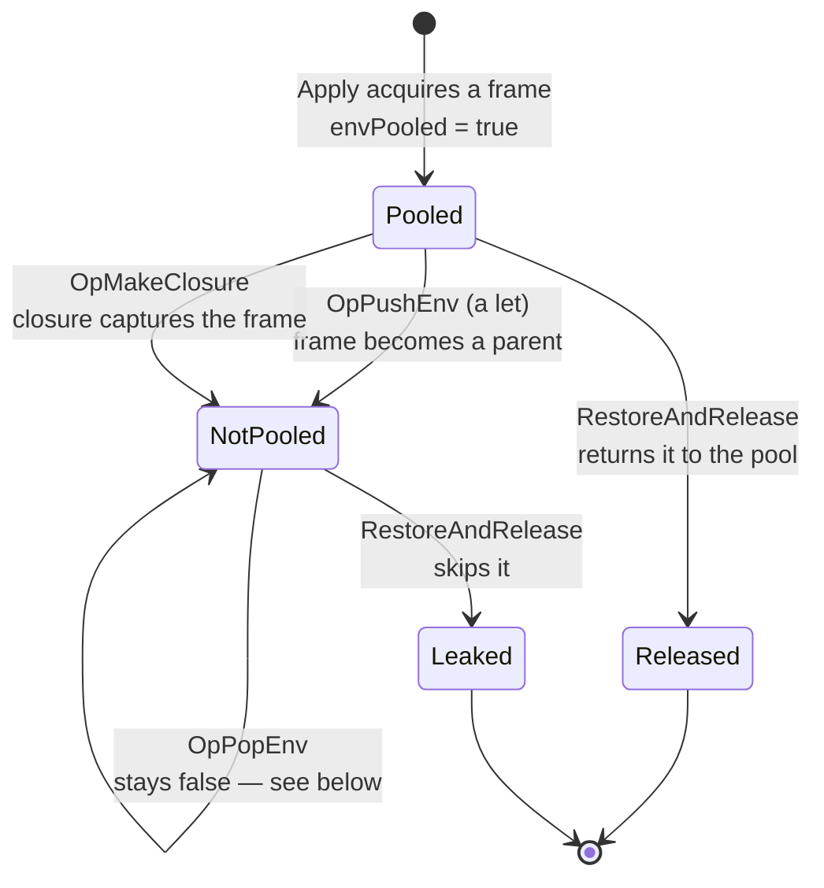
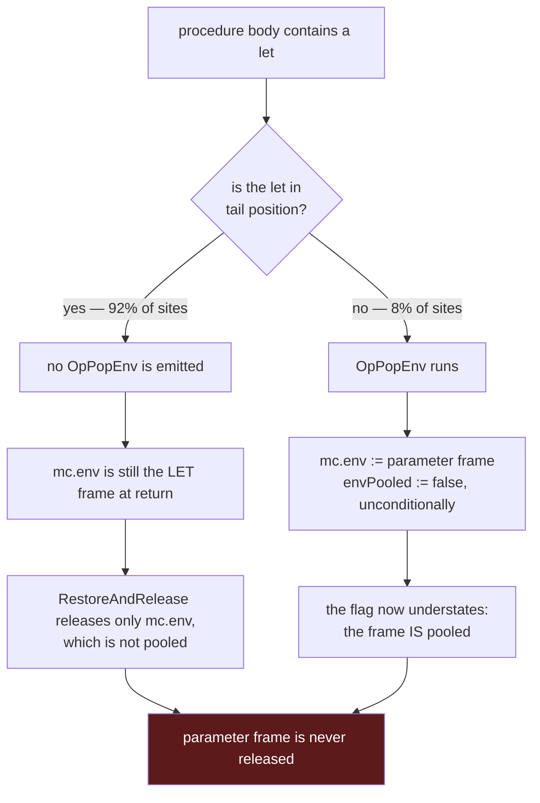
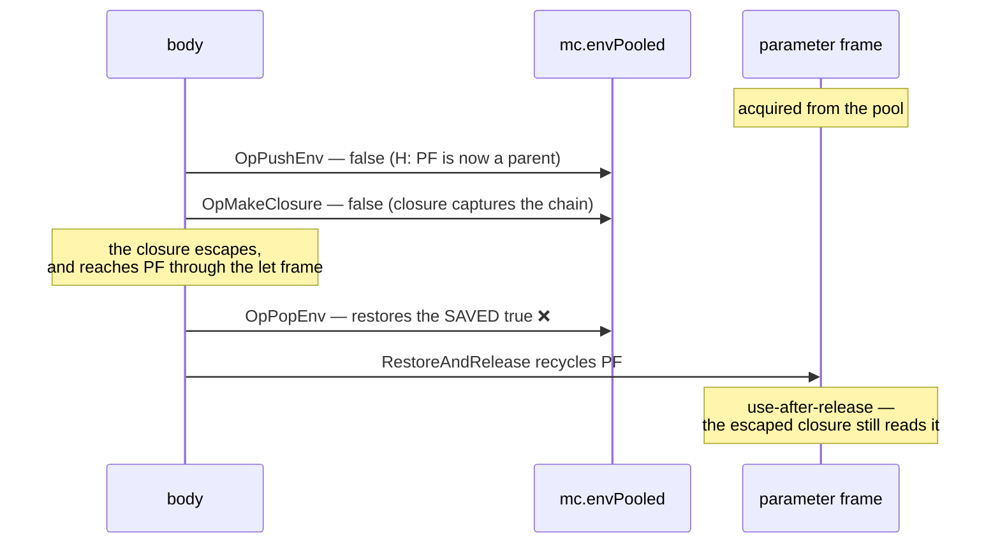

# Environment-Frame Allocation and Recovery

Every procedure call creates an environment frame. Most are recycled through a
freelist; a specific subset cannot be, and the reason is a load-bearing invariant
rather than an oversight.

This document explains which frames are recovered, which are not, and why the
obvious fix for the second group is unsound. It exists because that fix has been
proposed — and reverted — repeatedly.

> **Scope note (updated after let-slot merging).** This document was written when
> every `let` pushed its own frame. It no longer does. `canMergeLet`
> (`pkg/machine/compilation/merged_slots.go`) takes a merged `let`'s slots out of
> the enclosing lambda's parameter frame, and `CompileValidatedLet`'s own doc says
> what that means: a merged `let` "emits NEITHER bracket … That is the ordinary
> case — every let inside a procedure body — and the pushing form survives only
> where there is no frame to merge into (the top level, a syntax-case clause
> body)."
>
> So the `let`-frame cost analysed below is now a **narrow residual**, not the
> common case. Measured at `a204912d`, a self-tail loop wrapping one `let` and one
> wrapping two both allocate **0 frames per iteration**. What remains live and
> unchanged is everything about *parameter*-frame recovery and why a runtime
> recycle bit for it is unsound — which is the load-bearing half.

## Two kinds of frame, two very different costs

Two shapes remain, but the second is now rare — see the scope note. A `let`
inside a procedure body has no frame of its own at all.

| | parameter frame | **unmerged** `let` frame |
|---|---|---|
| created by | `Apply` (the closure-call path) | `OpPushEnv` — top level and `syntax-case` clause bodies only |
| construction | `acquireEnvFrame()` + `InitApplyFrameWithParent` | `NewLocalEnvironment` + `NewEnvironmentFrameWithParent` |
| pool-owned | **yes** | **no** |
| steady-state allocations | **~0** | **3** |

The parameter frame costs nothing in steady state because the apply path solved
the problem twice over: the frame struct and its bindings capacity come from a
freelist, and the *keys* map — the symbol-to-slot table — is not rebuilt at all.
`copyForApplyInto` shares it from the template's compile-time frame, which is a
per-template constant:

```go
dst.keys = p.keys        // SHARED, never rebuilt
dst.keysShared = true
if cap(dst.bindings) >= n { dst.bindings = dst.bindings[:n] } else { … }
```

`OpPushEnv` does neither. It builds a fresh keys map, a fresh bindings slice and a
fresh frame struct on every execution — three allocations, none recycled. That is
still true of `OpPushEnv`; what changed is how rarely a `let` reaches it. A `let`
in a procedure body compiles to `StoreLocal` into the enclosing parameter frame
and emits no bracket at all.



## The environment chain during a call

A procedure whose body contains a `let` builds a two-frame chain. The parameter
frame is the pooled one; the `let` frame hangs off it as a lexical child.

```scheme
(define (count-up i n)        ; parameter frame — slots i, n — POOLED
  (let ((j (+ i 1)))          ; let frame       — slot  j    — not pooled
    (if (>= j n) j (* j n))))
```



`mc.env` names the innermost frame. Everything the VM does to "the current frame"
— including releasing it — acts on whatever `mc.env` currently points at.

## `mc.envPooled`, and what it actually claims

`mc.envPooled` is one `bool` on `*machine.MachineContext` (`vm_state.go`). It is
**not** a property of a frame and **not** per-frame: it describes whichever frame
`mc.env` currently names, and it answers one question — *may this frame be
returned to the pool when it is overwritten?*

Four sites can make the current frame a **parent**. Three clear the flag in the
same step; `OpMakeClosure` clears it only in the retaining case, because flat
closures removed the general one:

| site | why it clears |
|---|---|
| `OpPushEnv` | the new `let` frame points at `mc.env` as its parent |
| `OpMakeClosure` | **only when the closure retains its lexical env.** A non-retaining closure records `env.TopLevel()` instead of `mc.env`, and its free variables travel by value in a vector, so it is not a parent and the flag stays set. The site's own comment calls this "narrowed to the retaining case … Keeping the flag set preserves H; it does not weaken it." |
| `OperationBindPatternVars` | `syntax-case` binds its pattern variables in a child frame (`compilation/operation_syntax_case.go:292`, cleared at `:350`) |
| `ClosureEnv`'s detached-env fallback | a `ForeignClosure` outliving its call is parented on `mc.env` when that frame has no mutable runtime (`machine_context.go:341`) |

`OpPushEnv` is now itself narrow (see the scope note), and `OpMakeClosure` clears
only when the closure retains. Each site carries its own clear. All four run under `Run` — being
"expand-time" is a claim about `syntax-case`'s phase, not about which loop
executes it. What is uniform across them has a name.

> **Invariant H.** A frame with `envPooled == true` is never any other frame's
> parent.

H is what makes the release cheap. `RestoreAndRelease` can hand `mc.env` back to
the freelist after a single check, with no walk over the frame's children,
because under H a releasable frame has none.



## Why the parameter frame is not recovered when a `let` runs

Once the `let` executes, the enclosing procedure's parameter frame is no longer
recoverable on return — and the mechanism differs by where the `let` sits.



The two shapes, and what each compiles to:

```scheme
;; TAIL — the let is the last thing the body evaluates.
;; Emits: PushEnv=1  PopEnv=0
(define (tail-let i n)
  (if (>= i n)
      i
      (let ((j (+ i 1)))
        (helper j n))))         ; mc.env is still the LET frame at return

;; NON-TAIL — the let is an argument, so its value must come back.
;; Emits: PushEnv=1  PopEnv=1
(define (arg-let i n)
  (+ (let ((j (+ i 1))) j)
     n))
```

In tail position the flag is *correct* — `mc.env` really is a non-pooled `let`
frame — and the limitation is **reach**: `RestoreAndRelease` releases exactly one
frame, and the pooled one is that frame's parent.

In non-tail position the flag is *conservative*: `OpPopEnv` restores `mc.env` to
the parameter frame but refuses to re-arm the release.

## Why `OpPopEnv` cannot simply restore the flag

The tempting fix is to have `OpPushEnv` save the old flag and `OpPopEnv` put it
back. It is unsound, and the reason is `OpMakeClosure`.



A program that walks that sequence:

```scheme
;; Emits: PushEnv=1  MakeClosure=1  PopEnv=1 — all three of the diagram's ops.
(define (leaky i n)
  (cons (let ((j (+ i 1)))
          (lambda () (+ i j)))  ; escapes, and reads i from the PARAMETER frame
        n))                     ; the let is an argument to cons, so PopEnv runs
```

A closure created inside the `let` body parents to the `let` frame and therefore
reaches the parameter frame transitively. `OpMakeClosure` protects it by clearing
the flag — but a saved-and-restored copy would overwrite that protection with a
value captured *before* the capture happened. `OpPopEnv` refuses unconditionally
precisely because it cannot know whether the frame it is popping escaped.

This is not a hypothetical. A runtime scheme for exactly this class — a per-frame
`captured` bit set at capture chokepoints — was implemented and reverted **three
times**, most recently 2026-06-10. It fixed the leak and crashed two continuation
suites with use-after-release. The transferable finding:

> Childlessness in the lexical tree is not recycle-safety in the
> continuation-reachability graph. No single chokepoint is crossed by every
> capture, so a per-frame bit set at a fixed set of sites cannot be complete.

## What it costs, measured

**Read the counters below as PARAMETER frames only.** An unmerged `let` frame
never enters the pool in either direction — `OpPushEnv` allocates one directly and
nothing ever calls `releaseEnvFrame` on it — so those frames are invisible to
these numbers and their recovery rate is **0%, in every row**. What the hit rate
measures is how often `Apply`'s acquire found a recycled *parameter* frame waiting
instead of minting a new one.

That was the shape of the cost when every `let` pushed: three frames' worth of
objects never recycled, **and** the enclosing procedure's parameter frame knocked
out of recovery — a different frame, and the one the pool exists for. Since
let-slot merging the first half is gone for every `let` in a procedure body, and
the second half is what the rest of this document is about.

The freelist's own counters, whole-program. **These were measured before let-slot
merging and have not been re-taken**; treat the shape as indicative and the
numbers as dated.

| benchmark | parameter frames acquired | released back | misses | recovered |
|---|---|---|---|---|
| `fib` (no `let`) | 2,692,550 | 2,692,549 | 27 | **100.0%** |
| `nqueens` | 8,503,623 | 5,623,346 | 2,880,278 | 66.1% |
| `sieve` | 1,040,948 | 694,591 | 346,358 | 66.7% |
| `peval` | 900,031 | 400,020 | 500,012 | 44.4% |

`fib` is the control: 27 misses across 2.7M acquires is warmup, and it shows the
pool works perfectly when frames come back. Everywhere else
`misses == in-flight-at-exit` exactly — every miss is one frame acquired and never
returned.

Re-measured at `e28364f9` (2026-08-19): all four recovery rates are unchanged and
every release count is identical. Acquires differ by 9 on `fib` and 1 on
`nqueens`, unattributed. The misses column was not re-read — it is the freelist's
own factory counter, not `VMCounters`.

Isolating the cause, on three `fib` variants that differ only in where a `let`
sits:

```scheme
;; 1 — no let
(define (fib n)
  (if (< n 2) n (+ (fib (- n 1)) (fib (- n 2)))))

;; 2 — a let in non-tail position (an argument to +)
(define (fib n)
  (if (< n 2) n (+ (let ((a (- n 1))) (fib a)) (fib (- n 2)))))

;; 3 — a let wrapping ONLY the base branch, off the recursive path entirely
(define (fib n)
  (if (< n 2) (let ((b n)) b) (+ (fib (- n 1)) (fib (- n 2)))))
```

Driven by `(fib 22)`, whose 57,313 activations are the whole of column one in row
1 — nothing else in the program applies a closure:

| body | parameter frames acquired | released back | recovered |
|---|---|---|---|
| no `let` | 57,313 | 57,313 | **100.0%** |
| `let` in non-tail position | 85,969 | 57,313 | 66.7% |
| `let` wrapping **only the base branch** | 57,313 | **28,656** | **50.0%** |

The third row is the sharpest: that `let` is off the recursive path and changes
no acquire count at all — and half the *parameter* frames stop coming back. The
28,657 activations that reach the base branch are exactly the ones that stop
releasing. It is a *tail* `let` — the last form the body evaluates on that branch
— so it compiles to `PushEnv` with no `PopEnv`, same as `tail-let` above. The
`let` frames it created are additional, and are not counted here because none of
them was ever poolable.

Per-iteration allocation for a loop, by shape:

```scheme
(define (tail-loop i n)
  (if (>= i n) i (tail-loop (+ i 1) n)))

(define (arg-loop i n)
  (if (>= i n) i (arg-loop (let ((j (+ i 1))) j) n)))

(define (nested-loop i n)
  (if (>= i n) i
      (let ((j (+ i 1)))
        (nested-loop j n))))

(define (deep-loop i n)
  (if (>= i n) i
      (let ((j (+ i 1)))
        (let ((k j))
          (deep-loop k n)))))
```

| shape | allocs/iteration, then | allocs/iteration, now |
|---|---|---|
| `tail-loop` — self-tail call, no `let` | 0 | 0 |
| `arg-loop` — `let` in argument position (call still at depth 0) | 3 | 0 |
| `nested-loop` — `let` wrapping the tail call | 3 | **0** |
| `deep-loop` — two `let`s wrapping the tail call | 6 | **0** |

The "then" column is this document's original measurement, and the last two rows
were 5 and 8 before that, when `OpSelfTailCall` could not yet unwind `let` frames.
The "now" column is measured at `a204912d`: both
`TestNestedLetSelfTailAllocations` and `TestDoublyNestedLetSelfTailAllocations`
(`pkg/wile/tail_call_alloc_test.go`) log **`slope=0.000 frames/iter`** — 14 allocs
at 10,000 trips and 14 at 30,000, i.e. a fixed startup cost and nothing per
iteration. Let-slot merging removed the frames entirely.

Both tests read the slope across two trip counts so a fixed cost cannot hide in
it, but note they assert a *ceiling* (`slope > 4.0` fails), not equality — so they
kept passing across the change, and their in-code comment still describes "the 3.0
let-frame floor" that no longer exists.

## What a sound recovery would need

Not a runtime flag — for this case. The discipline this codebase uses for nearly
every other frame reclamation is a **compile-time proof**, and the same one
applies here: a `let` body that provably creates no escaping closure and
references no capture operator cannot make its parent chain reachable, so the
enclosing frame stays releasable across it. Those two predicates already exist
(`bodyCreatesEscapingClosure`,
`bodyReferencesCaptureOperator`) and are already composed for the self-tail-call
proof. The minimal pair is `leaky` above against:

```scheme
(define (safe i n)
  (cons (let ((j (+ i 1)))
          (* i j))            ; no lambda, no call/cc — nothing outlives the let
        n))
```

**The one class recovered without a proof, and why it does not generalize.** Until
`e28364f9`, every `call-with-values`, `call-with-exit`, prompt, barrier and
`force` call drained exactly one frame from the pool: the helper builds its
continuation frame over `mc.env` — inside a primitive, that is the pooled apply
frame holding the primitive's own arguments — and `NewMachineContinuation` left
`envPooled` false, so the restore dropped it to the GC instead of recycling it.
The fix is a runtime **ownership transfer** (`transferEnvOwnership`,
`run_body_under_frame.go`): the pooled status moves to the continuation frame and
`p.envPooled` is cleared, so there is exactly one owner and no double release. Its
licence is that no bytecode runs between building the frame and applying the body,
so nothing can parent on it in that window. That is a window argument, not an
escape analysis, and a `let` is the opposite case — arbitrary bytecode runs under
it, which is what forces the proof.

Two separate pieces would follow from the proof. **Both were sized against a tree
in which every `let` pushed a frame, and let-slot merging took that population
away** — they now reach only unmerged `let`s, i.e. the top level and `syntax-case`
clause bodies. Kept because the reasoning is the same if the residual ever
matters:

- Re-arming the release at `OpPopEnv` behind that proof — reaches the share of
  unmerged `let` frames that have a pop (8% of the pre-merging population).
- Giving the tail-position case somewhere to release at all — the rest, and a
  design rather than a gate.

Independently, and needing no proof of any kind, an unmerged `let` frame's keys
map is a compile-time constant that `OpPushEnv` rebuilds every time. Interning the
compile-time frame as a template literal — exactly what `compileClosureBody`
already does for a lambda — would remove one of its three allocations. The same
caveat applies: merging already removed the sites where this would have paid.

**That argument was taken, and flat closures ship.** This section once framed it
as a standing alternative: rather than prove things about a capture path, delete
one. A **flat closure** holds the *values* of its free variables rather than a
pointer to the frame they live in. That is now the implementation —
`OpMakeClosure` links `env.TopLevel()`, not `mc.env`, and free variables travel by
value in a vector (`pkg/machine/operations_free.go` is the read side), which is
why the `envPooled` clear at that site is narrowed to the retaining case.

The corollary it did not carry still does not: captured continuations,
sub-contexts, SRFI-18 thread starts and `dynamic-wind` winders reach frames by
other routes, so a tail release would need that set re-derived on its own — which
is exactly the inference that failed three times above. Flat closures removed one
capture path; they did not remove the need for the proof.

## See also

- [`system.md`](system.md) — environment architecture, phases, binding stores
- [`diagram.md`](diagram.md) — the type relationships behind these frames
- [`../continuations/optimizations.md`](../continuations/optimizations.md) —
  continuation-side performance, including the continuation and stack pools
