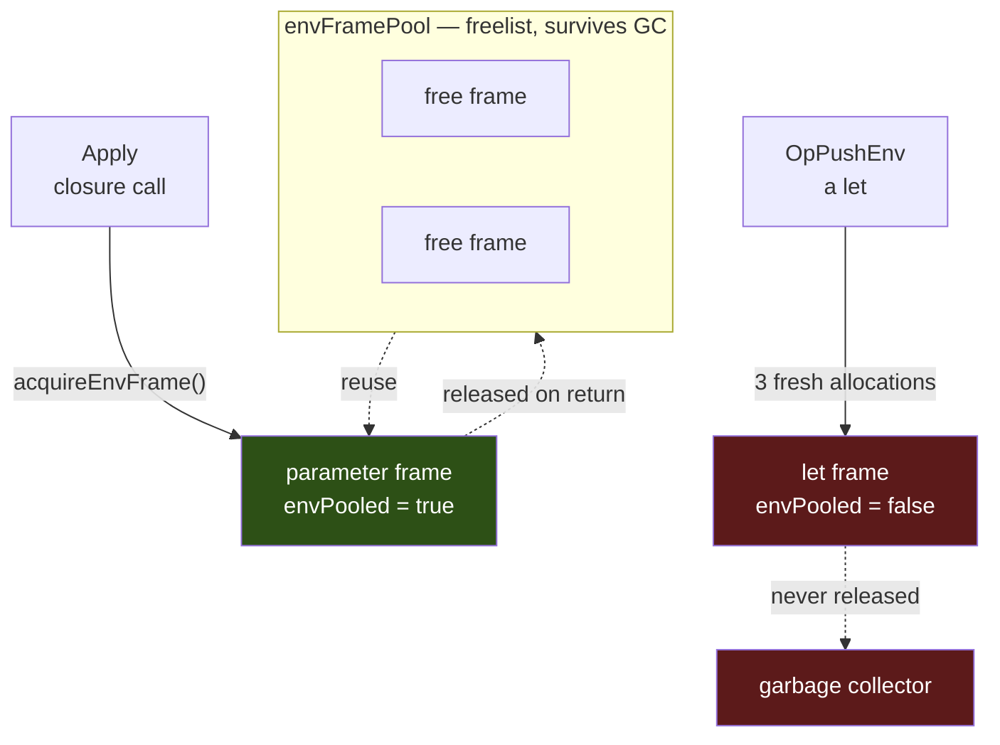
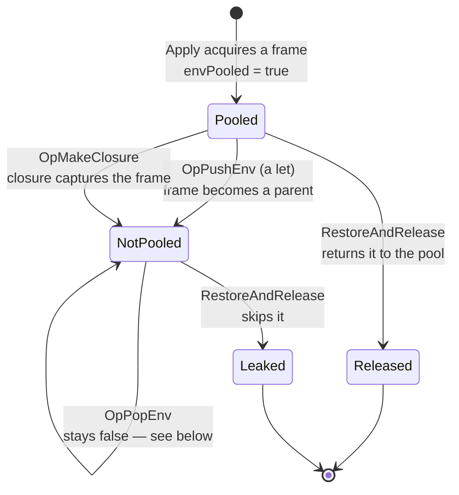
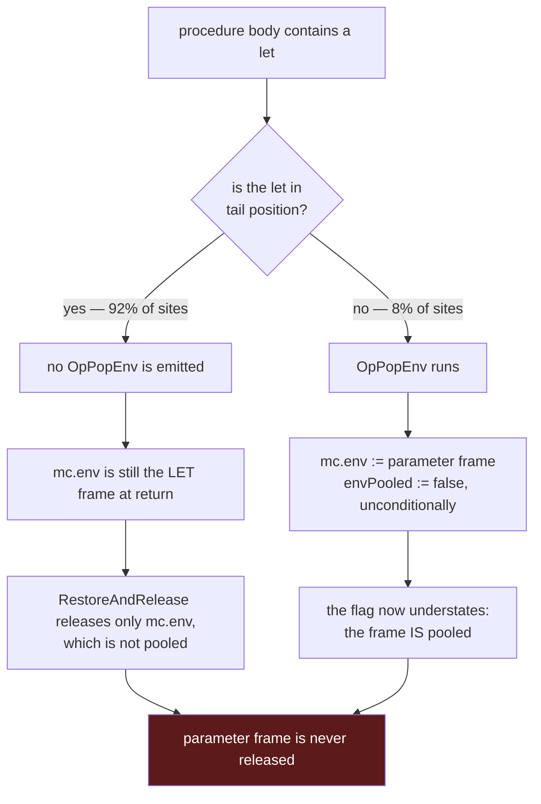
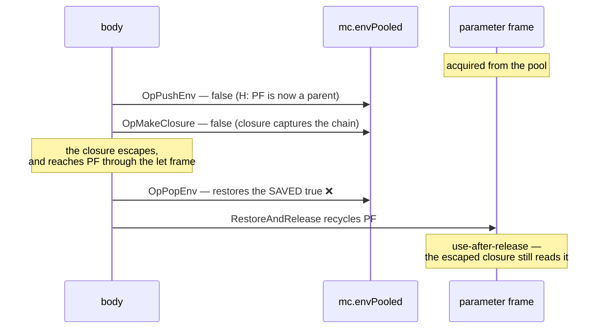

# Environment-Frame Allocation and Recovery

Every procedure call and every `let` creates an environment frame. Most of them
are recycled through a freelist; a specific, measurable subset cannot be, and the
reason is a load-bearing invariant rather than an oversight.

This document explains which frames are recovered, which are not, and why the
obvious fix for the second group is unsound. It exists because that fix has been
proposed — and reverted — repeatedly.

## Two kinds of frame, two very different costs

| | parameter frame | `let` frame |
|---|---|---|
| created by | `Apply` (the closure-call path) | `OpPushEnv` |
| construction | `acquireEnvFrame()` + `InitApplyFrameWithParent` | `NewLocalEnvironment` + `NewEnvironmentFrameWithParent` |
| pool-owned | **yes** | **no** |
| steady-state allocations | **~0** | **3** |

The parameter frame costs nothing in steady state because the apply path solved
the problem twice over: the frame struct and its bindings capacity come from a
freelist, and the *keys* map — the symbol-to-slot table — is not rebuilt at all.
`copyForApplyInto` shares it from the template's compile-time frame, which is a
per-template constant:

```go
dst.keys = p.keys        // SHARED, never rebuilt
dst.keysShared = true
if cap(dst.bindings) >= n { dst.bindings = dst.bindings[:n] } else { … }
```

`OpPushEnv` does neither. It builds a fresh keys map, a fresh bindings slice and a
fresh frame struct on every execution of the same `let` — three allocations, none
recycled.



## The environment chain during a call

A procedure whose body contains a `let` builds a two-frame chain. The parameter
frame is the pooled one; the `let` frame hangs off it as a lexical child.


`mc.env` names the innermost frame. Everything the VM does to "the current frame"
— including releasing it — acts on whatever `mc.env` currently points at.

## `mc.envPooled`, and what it actually claims

`mc.envPooled` is one `bool` on `*machine.MachineContext` (`vm_state.go`). It is
**not** a property of a frame and **not** per-frame: it describes whichever frame
`mc.env` currently names, and it answers one question — *may this frame be
returned to the pool when it is overwritten?*

Two runtime operations make the current frame a **parent**, and both clear it in
the same step:

| op | why it clears |
|---|---|
| `OpPushEnv` | the new `let` frame points at `mc.env` as its parent |
| `OpMakeClosure` | the closure holds `mc.env` as its captured parent |

Those are the only two runtime sites that build a frame parented to `mc.env`
(`machine_context.go`'s `OpPushEnv` case is the sole runtime
`NewEnvironmentFrameWithParent(_, mc.env)`; every other such call is compile- or
expand-time). That fact has a name.

> **Invariant H.** A frame with `envPooled == true` is never any other frame's
> parent.

H is what makes the release cheap. `RestoreAndRelease` can hand `mc.env` back to
the freelist after a single check, with no walk over the frame's children,
because under H a releasable frame has none.



## Why the parameter frame is not recovered when a `let` runs

Once the `let` executes, the enclosing procedure's parameter frame is no longer
recoverable on return — and the mechanism differs by where the `let` sits.



In tail position the flag is *correct* — `mc.env` really is a non-pooled `let`
frame — and the limitation is **reach**: `RestoreAndRelease` releases exactly one
frame, and the pooled one is that frame's parent.

In non-tail position the flag is *conservative*: `OpPopEnv` restores `mc.env` to
the parameter frame but refuses to re-arm the release.

## Why `OpPopEnv` cannot simply restore the flag

The tempting fix is to have `OpPushEnv` save the old flag and `OpPopEnv` put it
back. It is unsound, and the reason is `OpMakeClosure`.



A closure created inside the `let` body parents to the `let` frame and therefore
reaches the parameter frame transitively. `OpMakeClosure` protects it by clearing
the flag — but a saved-and-restored copy would overwrite that protection with a
value captured *before* the capture happened. `OpPopEnv` refuses unconditionally
precisely because it cannot know whether the frame it is popping escaped.

This is not a hypothetical. A runtime scheme for exactly this class — a per-frame
`captured` bit set at capture chokepoints — was implemented and reverted **three
times**, most recently 2026-06-10. It fixed the leak and crashed two continuation
suites with use-after-release. The transferable finding:

> Childlessness in the lexical tree is not recycle-safety in the
> continuation-reachability graph. No single chokepoint is crossed by every
> capture, so a per-frame bit set at a fixed set of sites cannot be complete.

## What it costs, measured

The freelist's own counters, whole-program:

| benchmark | acquires | releases | misses | hit rate |
|---|---|---|---|---|
| `fib` (no `let`) | 2,692,550 | 2,692,549 | 27 | **100.0%** |
| `nqueens` | 8,503,623 | 5,623,346 | 2,880,278 | 66.1% |
| `sieve` | 1,040,948 | 694,591 | 346,358 | 66.7% |
| `peval` | 900,031 | 400,020 | 500,012 | 44.4% |

`fib` is the control: 27 misses across 2.7M acquires is warmup, and it shows the
pool works perfectly when frames come back. Everywhere else
`misses == in-flight-at-exit` exactly — every miss is one frame acquired and never
returned.

Isolating the cause, on three `fib` variants that differ only in where a `let`
sits:

| body | acquires | releases | hit rate |
|---|---|---|---|
| no `let` | 57,313 | 57,313 | **100.0%** |
| `let` in non-tail position | 85,969 | 57,313 | 66.7% |
| `let` wrapping **only the base branch** | 57,313 | **28,656** | **50.0%** |

The third row is the sharpest: that `let` is off the recursive path and allocates
nothing — acquires are unchanged — and half the releases still vanish.

Per-iteration allocation for a loop, by shape:

| shape | allocs/iteration |
|---|---|
| self-tail call, no `let` | 0 |
| `let` in argument position (call still at depth 0) | 3 |
| `let` wrapping the tail call | 3 |
| two `let`s wrapping the tail call | 6 |

The last two rows were 5 and 8 before `OpSelfTailCall` learned to unwind `let`
frames; what remains in each is 3 per `let` frame, which is the subject of this
document.

## What a sound recovery would need

Not a runtime flag. The discipline this codebase uses for every other frame
reclamation is a **compile-time proof**, and the same one applies here: a `let`
body that provably creates no escaping closure and references no capture operator
cannot make its parent chain reachable, so the enclosing frame stays releasable
across it. Those two predicates already exist (`bodyCreatesEscapingClosure`,
`bodyReferencesCaptureOperator`) and are already composed for the self-tail-call
proof.

Two separate pieces would follow from it, and they are different sizes:

- Re-arming the release at `OpPopEnv` behind that proof — reaches the 8% of `let`
  frames that have a pop.
- Giving the tail-position case somewhere to release at all — the other 92%, and
  a design rather than a gate.

Independently, and needing no proof of any kind, the `let` frame's own keys map is
a compile-time constant that `OpPushEnv` rebuilds every time. Interning the
compile-time frame as a template literal — exactly what `compileClosureBody`
already does for a lambda — would remove one of the three allocations at every
site.

## See also

- [`system.md`](system.md) — environment architecture, phases, binding stores
- [`diagram.md`](diagram.md) — the type relationships behind these frames
- [`../continuations/optimizations.md`](../continuations/optimizations.md) —
  continuation-side performance, including the continuation and stack pools
