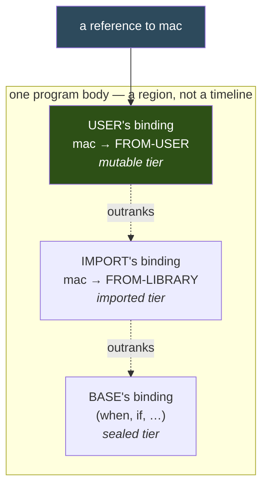
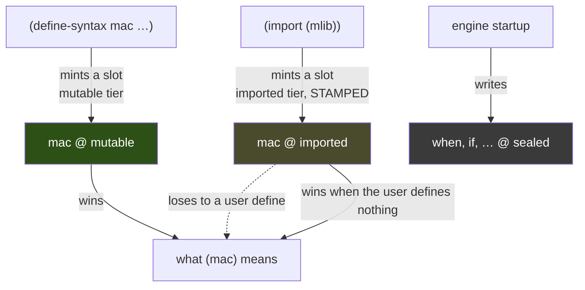

# `import` and `define`: which binding wins

A program can name the same identifier twice — once by importing it, once by
defining it. This document is about what happens to the *bindings* when it does,
why the answer is "the definition wins" regardless of the order the two were
written in, and why that is **not** the intuitive answer.

Everything here is measured against `wile`, `racket` 9.2 and `petite` 10.4.1.
Shipped 2026-10-02; the ratchet is `TestOrderSymmetryMatrix`
(`pkg/wile/order_symmetry_matrix_test.go`).

---

## The program that shows the question

```scheme
;; mlib.scm
(define-library (mlib)
  (import (scheme base))
  (export mac)
  (begin
    (define-syntax mac (syntax-rules () ((_) 'FROM-LIBRARY)))))
```

```scheme
;; m1.scm — define first, import second
(define-syntax mac (syntax-rules () ((_) 'FROM-USER)))
(import (mlib))
(mac)

;; m2.scm — import first, define second
(import (mlib))
(define-syntax mac (syntax-rules () ((_) 'FROM-USER)))
(mac)
```

| | `m1` (define, then import) | `m2` (import, then define) |
|---|---|---|
| **Wile, before 2026-10-02** | `FROM-LIBRARY` | `FROM-USER` |
| **Petite 10.4.1** | `FROM-LIBRARY` | `FROM-USER` |
| **Racket 9.2** | `FROM-USER` | `FROM-USER` |
| **Wile, now** | `FROM-USER` | `FROM-USER` |

Two different answers from one program, depending only on which line came
first. That is the defect — not the particular answer, the *disagreement*.

---

## Why the order-dependent answer is the intuitive one

It reads the file as a **sequence of operations on a mutable table**:


Under that reading `FROM-LIBRARY` is obviously right: `import` ran later, so it
overwrote. Nothing about it is sloppy. It is the same model as `set!`, as a
shell's `PATH=…`, as a later `#include` winning a macro redefinition in C. It is
also what Petite does, and Petite is not a careless implementation.

The trouble is that it makes two correct-looking programs disagree, and it makes
the disagreement **invisible**. Nothing is reported; `mac` simply means something
else. The clearest case needs no library at all:

```scheme
(define-syntax when (syntax-rules () ((_ a b) 'user-when)))
(import (scheme base))
(when 1 2)
```

Before this change that answered `2`. Not an error — `2`. The user's `when` was
replaced by `(scheme base)`'s in place, and base's `when` then evaluated its own
body. A program whose author had deliberately redefined `when` got the standard
`when` instead, silently. Petite answers `2` here too.

---

## The model Scheme actually specifies

R7RS does not describe a program body as a sequence of table writes. A body is a
**region**, and the definitions and imports in it are *declarations about that
region*, not operations ordered in time.

**R7RS §5.3.1** pins one corner of this directly. Describing a top-level
`define`, it says that where the variable is unbound *or is a syntactic
keyword*, the definition binds it to a **new location** before performing the
assignment — as opposed to the plain rebinding case, which behaves like `set!`
on the existing location. A new location, not a write to the existing one.

That sentence is about `define`. `define-syntax` is **§5.4**, which specifies
the transformer and says nothing about locations, so §5.3.1 does not cover
`define-syntax` over a keyword by quotation. What it establishes is the rule for
the neighbouring corner, and the rest follows from not making the four corners
disagree:

| | over a variable | over a syntactic keyword |
|---|---|---|
| `define` | rebinds (`set!`-like) | **new location — §5.3.1** |
| `define-syntax` | new location | new location *(by consistency)* |

Measured, so the "three of four already shadowed" claim is not an assumption —
each cell below is a one-line program against the shipped build:

| program | answer |
|---|---|
| `define` over an imported variable → `(define v 7)` | `7` (user) |
| `define` over base's `when` → `(define when 42)` | `42` (user) |
| `define-syntax` over an imported variable | `user-macro` |
| `define-syntax` over an imported macro — **this change** | `FROM-USER` |

So the user's `define-syntax` does not overwrite the import's binding; it creates
a *second* binding that **outranks** it:



Both bindings exist at once. Resolution picks the highest-ranked one, and rank
does not depend on textual order — so neither does the answer. `m1` and `m2`
*cannot* disagree, because order is not an input to the decision.

This is why the fix is a change of *tier*, not of sequencing. The import install
now places an imported binding on its own `tierExactImported` slot at every
phase; the user's definition lands on the mutable tier above it. Nothing is
overwritten, so nothing depends on when it was written.

---

## The three tiers, and what each operation does to them

Wile's binding store keys a name by (phase, sealed, scope-set, provenance) and
ranks the candidates. For the purpose of this document there are three ranks:

| rank | tier | who writes it |
|---|---|---|
| highest | `tierExactMutable` | the user's own `define` / `define-syntax` |
| middle | `tierExactImported` | an `import`, stamped `Imported` |
| lowest | `tierExactSealed` | the startup set: bootstrap macros, primitives |



Two properties of this arrangement are worth stating because they are what make
the change safe rather than merely desirable.

**An import can never land on a startup-set slot.** The store's slot-reuse rule
refuses to share a sealed-coordinate slot between bindings whose `Imported`
stamps differ, and that refusal carries **no phase restriction**. A bootstrap
macro is not `Imported`, so an import of the same name at the same coordinates
cannot reuse its slot — it gets a fresh one. That is the whole reason the
imported tier can exist at every phase; the separation is the *stamp*, not the
phase. Asserted on the store by
`TestImportDoesNotOverwriteSealedBootstrapMacro`.

**An import never reaches into a user binding either.** Shadowing is one-way:
the user's slot outranks the import's, and the import's own binding is left
untouched, stamp and all. `TestDefineSyntaxShadowsImportedMacro` asserts exactly
that — the user's binding is *not* pointer-identical to the import's, and the
import's is still `Imported` afterwards.

---

## Why this is not a free choice between two defensible readings

Petite's answer and Racket's answer are both self-consistent. Where R7RS is
silent, Wile treats Chez and Racket as examples rather than authorities, and a
tie between them is settled on other grounds.

**R7RS is not silent about the neighbouring corner**, and that is enough to
settle this one. §5.3.1's new-location rule for a `define` over a syntactic
keyword is spec text, and it describes the region model rather than the timeline
model. It does not name `define-syntax`, so this is not a one-line appeal to
authority — but it does mean the timeline reading is already wrong for one of
the four definition-over-binding corners, and no reading of the spec makes the
remaining three go the other way.

Two further reasons, and the first is the one that actually carries the weight:

- **Three of the four corners already shadowed.** A plain `define` over an
  imported *variable* has always created a new binding that outranks the import,
  in either order; so has a `define` over a keyword, per §5.3.1; so has a
  `define-syntax` over a variable. Only `define-syntax` over an imported *macro*
  superseded. The old behaviour therefore made a program's meaning depend on
  whether the name it redefined happened to be a macro — and, because macro
  bindings live one phase up, on which phase the name lived at. **Uniformity is
  the argument, not the citation.**
- **The failure mode is silence.** Under the timeline model a lost definition
  produces no diagnostic, because nothing went wrong *within* the model: a write
  happened, then another write happened. Under the region model the two bindings
  coexist and the ranking is explicit, so there is a thing to inspect.

---

## What this does *not* change

- **A second `import` of one name.** Two imports of a name still resolve to the
  last one; imports share a tier, so this is genuinely last-wins and is R7RS
  §5.6's conflict question rather than this one. A conflicting import of two
  *different* bindings is still refused outright, at the import itself.
- **`set!` on an imported variable.** Still refused —
  `set!: cannot mutate imported binding "c"`. Shadowing gives you a new location
  to define; it does not give you write access to the library's. (A macro is not
  in the value namespace at all, so `set!` on an imported *keyword* fails
  earlier, as an unbound variable.)
- **A library body's own `define` over a name the library imports.** Unchanged,
  and left deliberately: inside a library the definition carries the library's
  scope and already gets its own slot, so it already shadows without any tier
  change. That call site is a separate decision with no filed defect behind it.
- **Variables at phase 0.** Already correct before this change; those rows of
  the matrix pass on the old build and are its non-vacuity guard.

---

## Reproducing the table

```sh
make build
W=./dist/$(go env GOOS)/$(go env GOARCH)/wile

mkdir -p libs
cat > libs/mlib.scm <<'EOF'
(define-library (mlib)
  (import (scheme base))
  (export mac)
  (begin
    (define-syntax mac (syntax-rules () ((_) 'FROM-LIBRARY)))))
EOF

printf '(import (scheme base) (scheme write))\n(define-syntax mac (syntax-rules () ((_) (quote FROM-USER))))\n(import (mlib))\n(display (mac))\n' > m1.scm
printf '(import (scheme base) (scheme write) (mlib))\n(define-syntax mac (syntax-rules () ((_) (quote FROM-USER))))\n(display (mac))\n' > m2.scm

$W -q -L libs m1.scm   # FROM-USER
$W -q -L libs m2.scm   # FROM-USER
```

The oracle rows need the equivalent library in each host's own module system:
`#lang racket/base` with `provide`/`require` for Racket, and an R6RS `(library
(mlib) (export mac) (import (rnrs)) …)` under `--libdirs` for Petite.

---

## Pointers

- `installImportedBinding` (`pkg/machine/compilation/library_bindings.go`) — the
  placement decision, and the argument for why the imported tier is available at
  every phase.
- `createGlobalBindingAt` (`pkg/environment/global_environment_frame.go`) — the
  `sealed && IsImported() != imported` slot-reuse refusal that the previous
  paragraph depends on.
- `TestOrderSymmetryMatrix` (`pkg/wile`) — the ten-row ratchet: variables and
  macros, both orders, phases 0 and 1, plus the double-import pair.
- `docs/environment/system.md` — the store, phases and tiers in full.
- A related but distinct defect, still open: a `syntax-rules` **template** can
  read a `define-for-syntax` binding, so a phase-0 reference resolves against a
  phase-1 slot. Racket refuses that; Wile does not. Filed in `TODO.md`. It
  matters when measuring anything about phase-1 visibility — read a phase-1
  binding from a `(lambda (stx) …)` transformer body, never from a template, or
  the measurement is about the leak instead of about the thing being measured.
